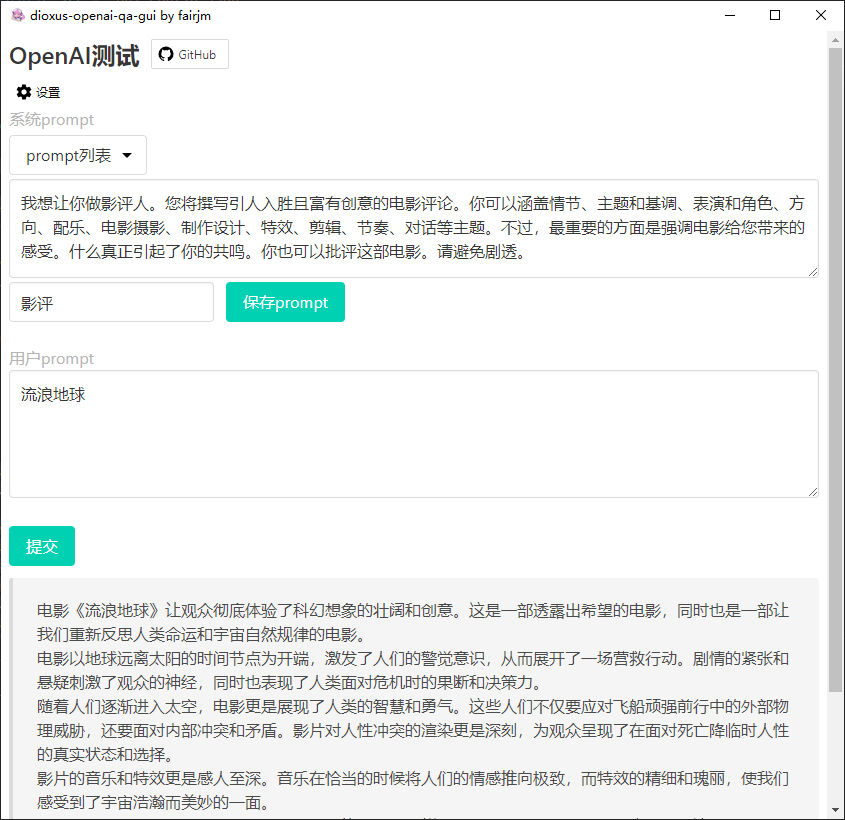
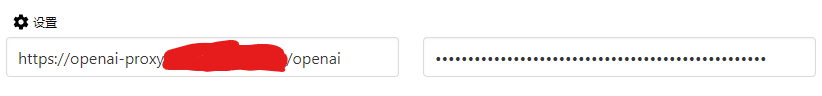
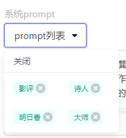

# 一个简单的openai chat接口测试小工具
基于 [dioxus](https://github.com/DioxusLabs/dioxus) 和 [bulma](https://bulma.io) (css)

# Intro
用来做一些简单的问答（没有实现对话），可以保存prompt进行一些验证，探索。



## 设置

第一项是proxy的地址 如果可以直连就使用`https://api.openai.com`  
第二项是openai的secret
设置会在生成`gui_config.json`文件, secret明文存储请注意安全  

## prompts
  
prompts列表会生成`system_prompts.json`文件  
可以直接复制/编辑这个文件来修改内容(需要重新打开应用,不然会被应用覆盖)  

正常返回输出的内容在程序所在的`output\`目录中


# How to run
需要本地安装`rust`, windows环境有edge(`webview2`)即可。  
其他环境参考:  [dioxuslabs - desktop](https://dioxuslabs.com/docs/0.3/guide/en/getting_started/desktop.html)  

执行:
```shell
cargo run

# debug build
cargo build

# release build
cargo build --release
```

或者直接下载release  
